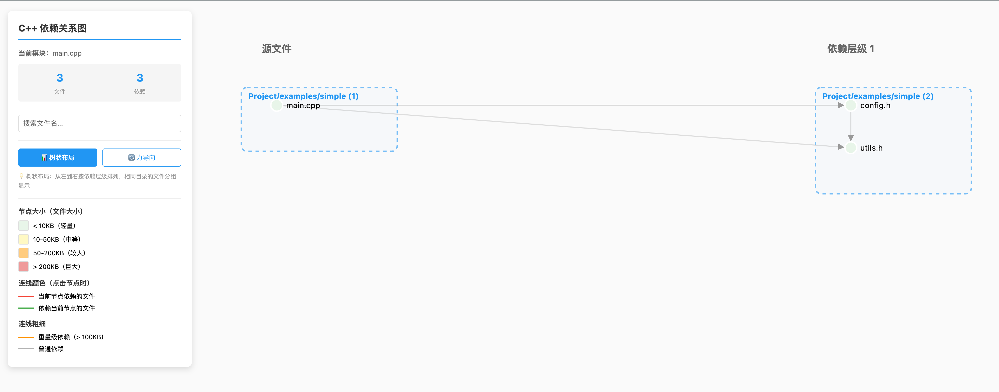

# C++ 依赖关系分析工具

一个强大的 C++ 模块依赖关系分析和可视化工具，支持生成交互式 HTML 依赖图。

[](https://opensource.org/licenses/MIT)
[](https://www.python.org/downloads/)

## ✨ 功能特性

### 📊 批量分析
- 支持同时分析多个 C++ 源文件
- 通过 Previous/Next 按钮或方向键切换不同模块
- 轻松浏览复杂项目的依赖关系

### 🎯 智能库分类
- **系统库**：C/C++ 标准库和 Linux 系统头文件
  - `System/C++ Standard Library`: C++ 标准库
  - `System/Linux Headers`: Linux 系统头文件
  - `System/Other`: 其他系统库

- **第三方库**：常见的第三方依赖库
  - `Third-Party/Boost`: Boost 库
  - `Third-Party/Abseil`: Abseil 库
  - `Third-Party/bRPC`: bRPC 框架
  - `Third-Party/gflags`: gflags 命令行参数库
  - `Third-Party/glog`: glog 日志库
  - `Third-Party/Protobuf`: Protocol Buffers
  - 以及更多...

- **项目文件**：当前项目的源文件
  - `Project/xxx`: 按目录结构分组
  - `Generated/Proto Files`: 生成的 Protobuf 文件

### 🎨 交互式可视化
- **两种布局模式**：
  - 树状布局：按依赖层级从左到右排列
  - 力导向布局：动态物理模拟布局

- **交互功能**：
  - 点击节点查看依赖关系（红色=依赖的文件，绿色=被依赖的文件）
  - 拖拽节点调整位置
  - 搜索框过滤文件
  - 鼠标滚轮缩放，拖拽画布移动
  - 键盘快捷键快速导航

- **视觉提示**：
  - 节点颜色表示文件大小（绿色=小，黄色=中，橙色=大，红色=巨大）
  - 连线粗细表示依赖重要性

## 🚀 快速开始

> 📖 **第一次使用？** 查看[快速开始指南](QUICK_START.md)，5 分钟上手，包含常见使用场景！

### 安装

```bash
git clone https://github.com/yourusername/cxx_includes_analysis.git
cd cxx_includes_analysis
```

无需安装依赖 - 仅需 Python 3.6+ 标准库！

### 试试示例

```bash
# 分析内置示例
python3 analyze_includes.py examples/simple/main.cpp -I examples/simple

# 浏览器中打开生成的 HTML
open dependency_graph.html
```

### 分析你的代码

```bash
# 单个文件
python3 analyze_includes.py src/main.cpp

# 多个文件，自定义路径
python3 analyze_includes.py src/*.cpp -I ./include -o project_deps.html
```

**📚 更多示例和详细用法，请查看：**
- [快速开始指南](QUICK_START.md) - 5 分钟教程
- [用户指南](docs/USER_GUIDE_zh.md) - 完整文档
- [示例项目](examples/) - 示例代码

## 📖 文档

- **[快速开始指南](QUICK_START.md)** - 5 分钟教程，包含常见场景
- **[用户指南](docs/USER_GUIDE_zh.md)** - 完整使用说明和最佳实践
- **[API 文档](docs/API.md)** - 库 API 参考，用于编程调用
- **[示例项目](examples/)** - 示例代码和用例

## 📋 命令行参数

| 参数 | 说明 | 默认值 |
|------|------|--------|
| `source_files` | 要分析的 C++ 源文件（支持多个） | 必需 |
| `-I, --include` | 添加 include 搜索路径（可多次使用） | 预定义路径 |
| `--depth` | 最大递归深度 | 3 |
| `--deep-system` | 深度扫描系统头文件 | False |
| `--format` | 输出格式：html/dot/both | html |
| `-o, --output` | 输出文件名 | dependency_graph.html |


## 🔧 配置

通过编辑 `analyze_includes_lib/config.py` 自定义工具：

- **Include 路径**：添加项目的 include 目录
- **第三方库**：定义自定义库分类
- **视觉设置**：调整颜色和大小阈值

> 📖 详见[用户指南 - 配置](docs/USER_GUIDE_zh.md#配置)


## 📝 许可证

本项目采用 MIT 许可证 - 查看 [LICENSE](LICENSE) 文件了解详情。

## 🙏 致谢

- [D3.js](https://d3js.org/) - 交互式可视化
- [Graphviz](https://graphviz.org/) - DOT 格式支持

## 📮 联系方式

如有任何问题或建议，请在 GitHub 上提交 issue。

## 📊 截图

### 示例输出
这是内置示例项目生成的依赖关系图：



*交互式可视化展示了 main.cpp、utils.h、config.h 与系统头文件之间的依赖关系*

### 功能展示
- 🎯 **节点颜色**：文件大小可视化（绿色=小，黄色=中等）
- 🔗 **边连接**：清晰的依赖关系
- 📁 **智能分组**：系统库、项目文件有序组织
- 🎨 **交互式**：点击、拖拽、缩放，自由探索！

---

**如果觉得有帮助，请给个 Star ⭐！**

